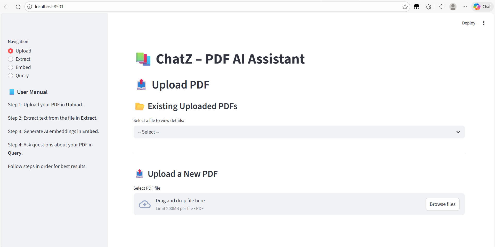
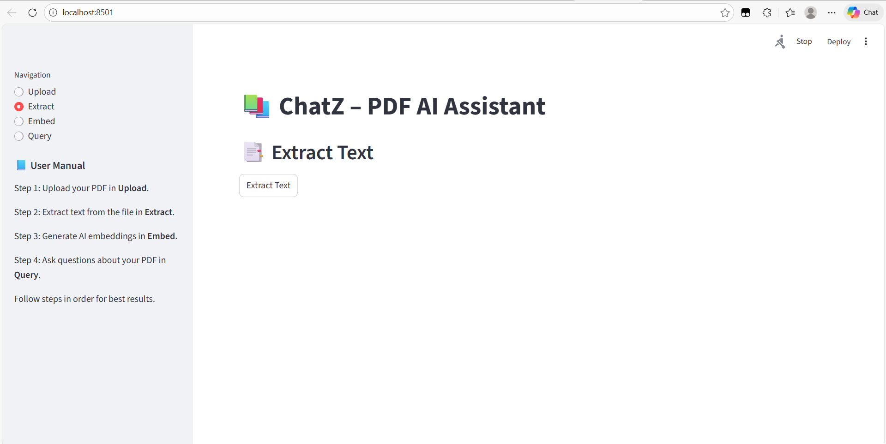
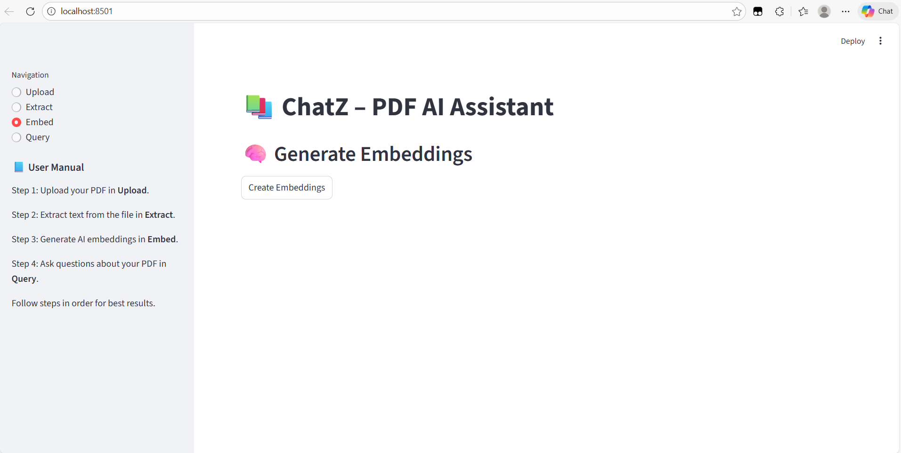
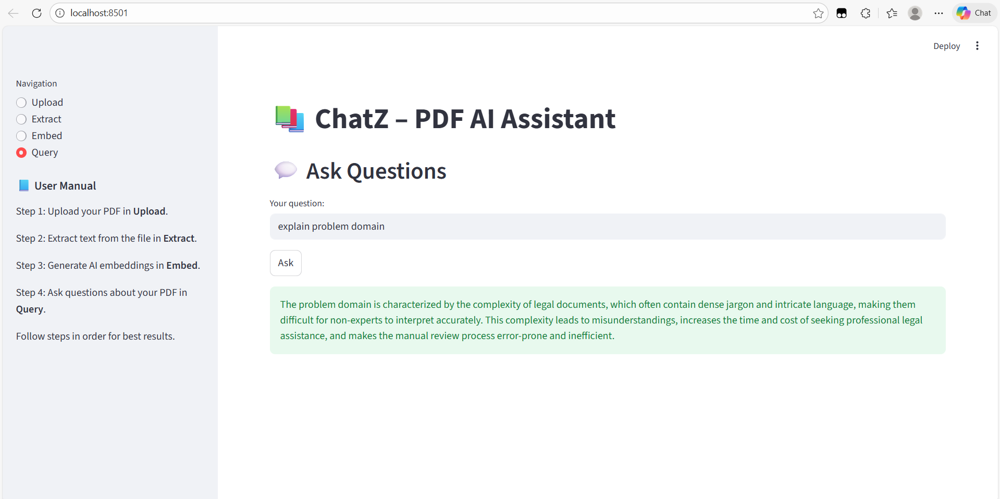

# ChatZ Project Workflow Documentation

## Overview

This document provides a comprehensive workflow diagram for the ChatZ PDF Query System. The system processes PDF documents through a five-stage pipeline to enable intelligent querying using AI.

## Key Features

✅ **File Validation**: Ensures only valid PDF/TXT files are processed  
✅ **Duplicate Detection**: Checks for existing files before re-uploading  
✅ **Metadata Tracking**: Maintains file information in SQLite database  
✅ **Efficient Chunking**: Overlapping chunks prevent information loss  
✅ **Vector Search**: Fast similarity search using ChromaDB  
✅ **Document-Specific**: Queries are filtered by file_id  
✅ **Context-Aware**: LLM receives relevant context for accurate answers  
✅ **Clean Architecture**: Separation of concerns with router modules  

## Workflow Stages

### 📤 Stage 1: Upload
**Purpose**: Accept and validate user-uploaded PDF/TXT files

**Process**:
1. User uploads file via frontend (Streamlit)
2. Backend validates file type (PDF/TXT only)
3. Checks for duplicate files by filename
4. Generates unique `file_id` (UUID)
5. Saves file to `uploaded_pdfs/` directory
6. Extracts metadata (page count using PyMuPDF)
7. Stores record in SQLite database
8. Sets `embedding_status = False`

**Output**: `file_id`, `file_name`, `num_pages`, `uploaded_at`

---

### 📑 Stage 2: Extract
**Purpose**: Extract text content from PDF files

**Process**:
1. Reads PDF from `uploaded_pdfs/{file_id}.pdf`
2. Uses PyPDF2 to extract text from all pages
3. Combines all pages into single text string
4. Saves extracted text to `extracted_text/{file_id}.txt`
5. Generates preview text (first 1000 chars or 20 lines)
6. Returns preview for user verification

**Output**: Preview text, text length, file metadata

---

### ✂️ Stage 3: Chunk
**Purpose**: Split extracted text into manageable pieces for embedding

**Process**:
1. Reads extracted text file
2. Splits text into chunks of 500-1000 characters
   - Default: 700 characters per chunk
   - Overlap: 100 characters between chunks
3. Each chunk is linked to `file_id` via metadata
4. Overlap prevents information loss at boundaries

**Output**: Array of text chunks ready for embedding

**Note**: Chunking happens automatically within the Embed stage in the current implementation.

---

### 🧠 Stage 4: Embed
**Purpose**: Convert text chunks into vector embeddings and store in vector database

**Process**:
1. Reads extracted text file
2. Chunks the text (700 chars, 100 overlap)
3. For each chunk:
   - Passes chunk to Google Generative AI Embedding model
   - Model: `models/gemini-embedding-001`
   - Generates high-dimensional vector embedding
   - Creates unique ID: `{file_id}_chunk_{i}`
   - Stores in ChromaDB with metadata (file_id, chunk_id)
4. Updates SQLite database: sets `embedding_status = True`
5. Deletes temporary extracted text file (cleanup)

**Output**: Confirmation with total number of chunks created

**Storage**: ChromaDB vector database (local persistent storage)

---

### 💬 Stage 5: Query
**Purpose**: Answer user questions based on document content

**Process**:
1. Receives user question and `file_id`
2. Embeds the question using same embedding model
3. Performs similarity search in ChromaDB:
   - Filters by `file_id` to ensure document-specific results
   - Finds top 3 most similar chunks (cosine similarity)
   - Retrieves chunk text and metadata
4. Builds context string from retrieved chunks
5. Sends context + question to Gemini LLM
   - Model: `gemini-2.5-flash`
   - Prompt includes context and user question
   - Instructs LLM to answer in 4-5 lines
6. Returns LLM-generated answer to user

**Output**: Final answer based on document content

---

## Technology Stack

| Component | Technology |
|-----------|-----------|
| **Backend Framework** | FastAPI |
| **Frontend** | Streamlit |
| **PDF Processing** | PyPDF2, PyMuPDF |
| **Embedding Model** | Google Generative AI (gemini-embedding-001) |
| **Vector Database** | ChromaDB (Persistent) |
| **LLM** | Google Gemini (gemini-2.5-flash) |
| **Relational Database** | SQLite |
| **Language** | Python 3.12+ |

## Data Flow

```
User Upload
    ↓
[Uploaded PDF] → uploaded_pdfs/{file_id}.pdf
    ↓
[Extract Text] → extracted_text/{file_id}.txt (temporary)
    ↓
[Chunk Text] → Array of chunks
    ↓
[Generate Embeddings] → Vector embeddings
    ↓
[Store in ChromaDB] → chroma_db/ (persistent)
    ↓
[User Query] → Embedded question
    ↓
[Similarity Search] → Top 3 relevant chunks
    ↓
[LLM Processing] → Context + Question → Answer
    ↓
User receives answer
```

## Folder Structure

```
ChatZ/
├── uploaded_pdfs/          # Original PDF files (persistent)
├── extracted_text/         # Extracted text (temporary, deleted after embedding)
├── chroma_db/             # ChromaDB vector database (persistent)
├── files.db               # SQLite database (file metadata)
├── backend/
│   ├── routers/
│   │   ├── upload.py      # Upload endpoint
│   │   ├── extract.py     # Extract endpoint
│   │   ├── chunk.py       # Chunking utility
│   │   ├── embed.py       # Embedding endpoint
│   │   └── query.py       # Query endpoint
│   ├── models.py          # Database models
│   ├── database.py        # Database configuration
│   └── main.py            # FastAPI application
└── frontend/
    └── index.py           # Streamlit frontend
```


## Usage Flow

1. **Upload**: User uploads a PDF file through the Streamlit interface
2. **Extract**: User clicks "Extract Text" button to extract text content
3. **Embed**: User clicks "Create Embeddings" to generate and store vectors
4. **Query**: User enters questions and receives AI-generated answers

## API Endpoints

- `POST /upload/upload_file` - Upload PDF/TXT file
- `GET /extract/{file_id}` - Extract text from PDF
- `POST /embed/{file_id}` - Generate embeddings
- `POST /query/` - Query the document


# 🚀 How to Run the Project

Follow these steps to set up and run the project on your local system:

### 1️⃣ Clone the Repository
- Clone the project from GitHub using:
 ```bash
git clone https://github.com/Mugdha7503/ChatZ.git
cd ChatZ
```

### 2️⃣ Create a Virtual Environment
```bash
python -m venv venv
```
- Activate the Virtual Environment
```bash
venv\Scripts\activate
```

### 3️⃣ Install Dependencies
```bash
pip install -r requirements.txt
```

### 4️⃣ Run the Development Server
```bash
uvicorn backend.main:app --reload
streamlit run frontend/index.py
```

## 📸 Screenshots

| Upload | Extract |
|-----------|------------|
|  |  |

| Embed | Query |
|-----------|------------|
|  |  |

## 👥 Contributors

- [Vandana Ranasara](https://github.com/vandanaranasara)
- [Mugdha Upadhyay](https://github.com/mugdha7503)